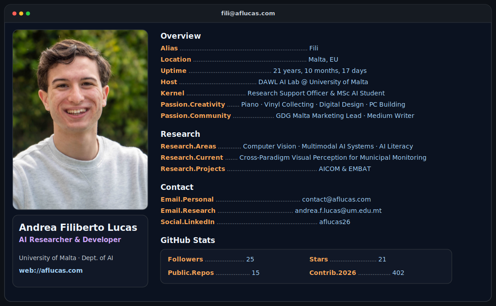

<a href="https://github.com/AFLucas-UOM">
  
</a>

<p align="center">
  <a href="mailto:contact@aflucas.com"></a>
  <a href="https://aflucas.com"></a>
  <a href="https://www.linkedin.com/in/aflucas26"></a>
  <a href="https://scholar.google.com/citations?user=fWevBSQAAAAJ&hl=en"></a>
</p>

<details>
<summary><strong>About me, research and technical toolkit</strong></summary>

## About Me

```python
class AboutMe:
    def __init__(self):
        self.name = "Andrea Filiberto Lucas"
        self.alias = "Fili"
        self.location = "Malta, EU"

        self.affiliations = [
            "University of Malta, Department of AI",
            "DAWL AI Lab",
        ]

        self.roles = [
            "AI Researcher & Developer",
            "Research Support Officer I",
            "MSc Artificial Intelligence Student",
        ]

        self.research_areas = [
            "Computer Vision (CV)",
            "Multimodal AI Systems",
            "AI Literacy",
        ]

        self.current_research = (
            "Cross-Paradigm Visual Perception for Municipal Monitoring"
        )

        self.research_projects = ["AICOM", "EMBAT"]
```

## Contact and Research Profiles

[](mailto:contact@aflucas.com)
[](mailto:andrea.f.lucas@um.edu.mt)
[](https://www.linkedin.com/in/aflucas26)
[](https://aflucas.medium.com/)
[](https://ieeexplore.ieee.org/author/266736498588056)
[](https://arxiv.org/search/cs?searchtype=author&query=Lucas%2C+A+F)
[](https://www.researchgate.net/profile/Andrea-Filiberto-Lucas)

## Technical Toolkit

### Programming and Data


### Artificial Intelligence and Computer Vision


### Web, Cloud and Tooling


</details>

<p align="center">
  <sub>
    This README is licensed under <a href="./LICENSE">CC BY 4.0</a>.
    Attribution appreciated: <a href="https://github.com/AFLucas-UOM">@AFLucas-UOM</a>
  </sub>
</p>
